# mentoo-app
"#Men Too" is a help platform designed to provide immediate assistance to male victims of sexual abuse. This project implemented a static mobile web application for presentation purpose. It is written using Vus.js and deployed on GitHub Pages. See the online demo here: https://mentoo-app.github.io

## Some screen shots of the mobile-apps
<p align="middle">
  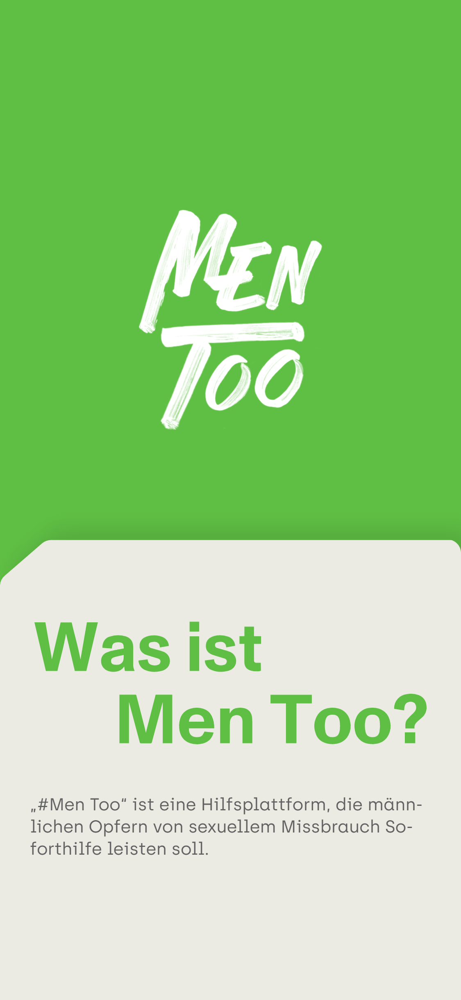
  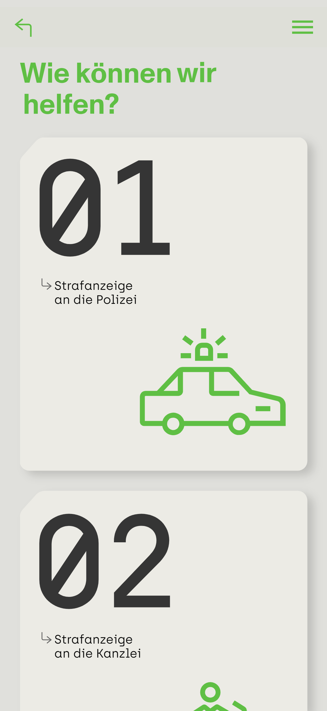 
  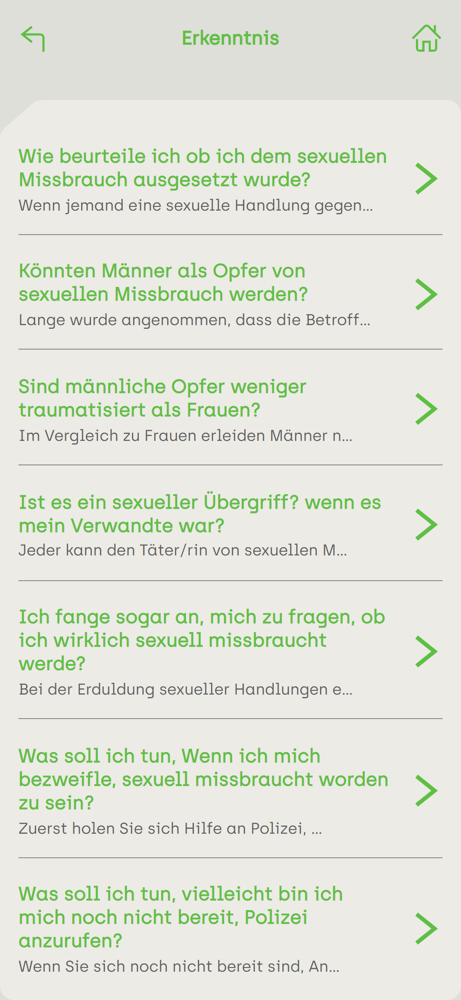
  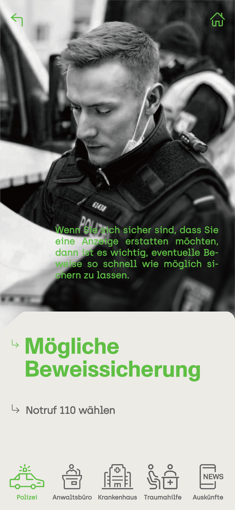
</p>
<p align="middle">
  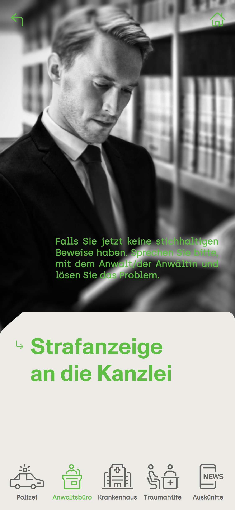
  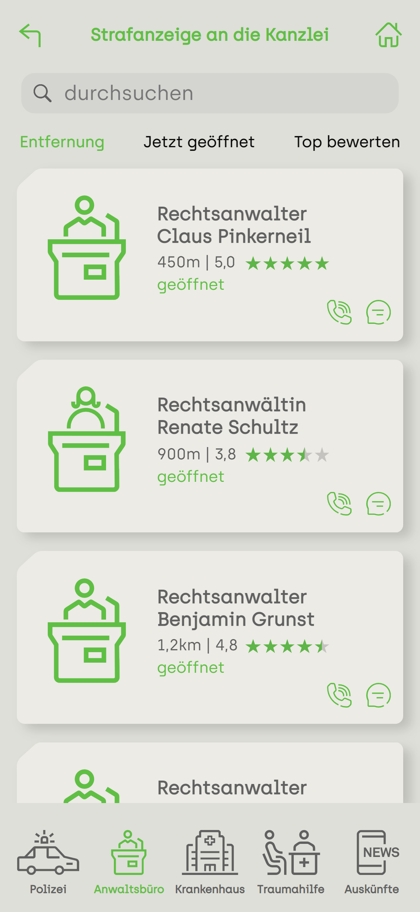 
  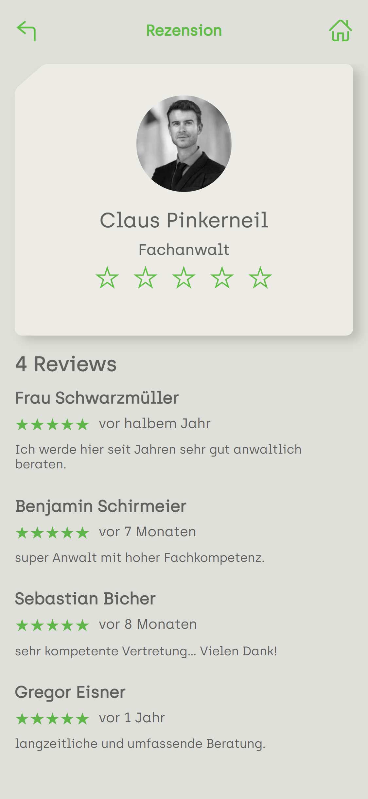
  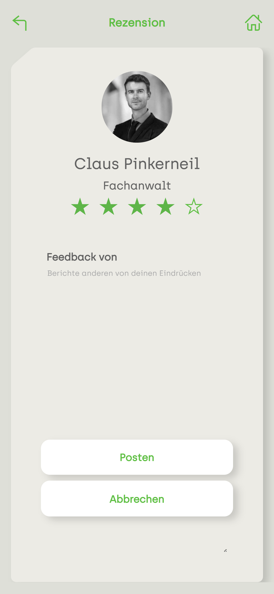
</p>
<p align="middle">
  
  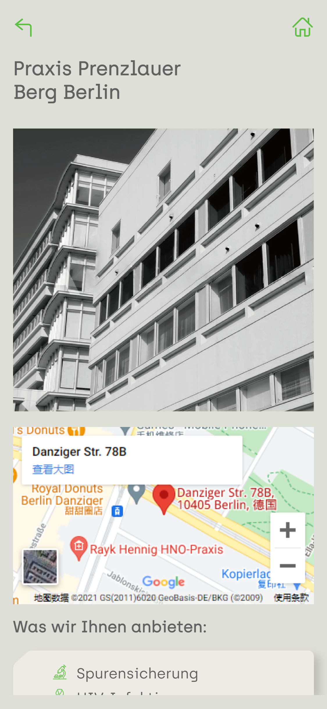 
  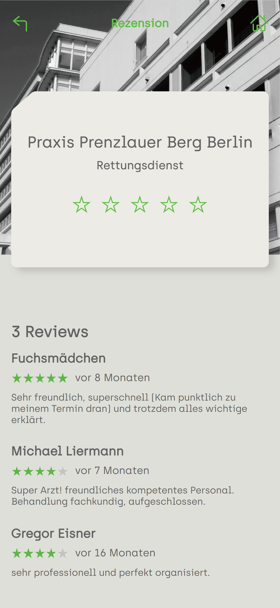
  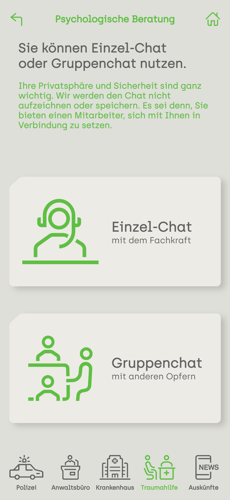
</p>
<p align="middle">
  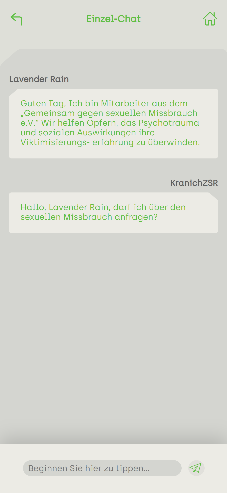
  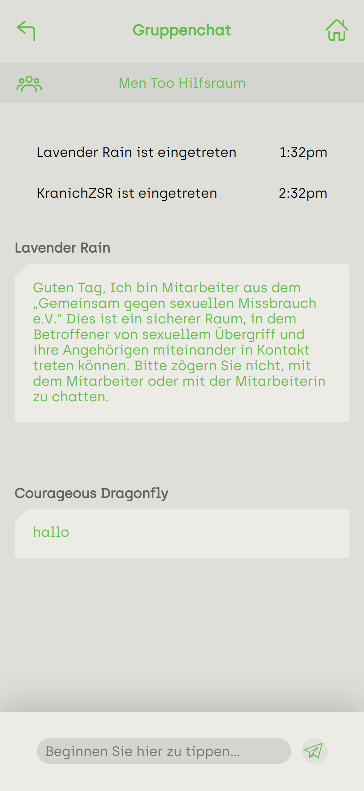 
  
  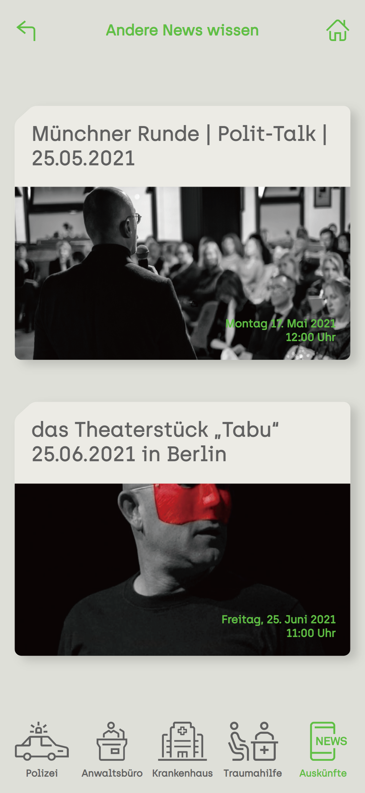
</p>

## Project setup
```
npm install
```

### Compiles and hot-reloads for development
```
npm run serve
```

### Compiles and minifies for production
```
npm run build
```

### Lints and fixes files
```
npm run lint
```

### Customize configuration
See [Configuration Reference](https://cli.vuejs.org/config/).
